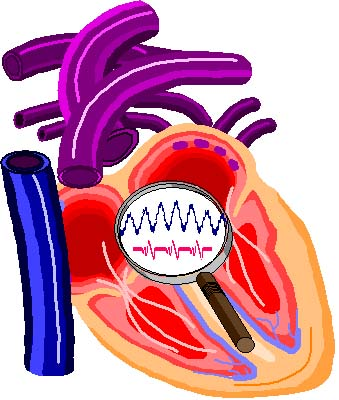

# {: style="width: 80px; height:80px; vertical-align: middle;" } {{ page.title }}

## Host

The Phoenix Project operates as a study group of the [Twin Cities Section of the Institute of Electrical and Electronics Engineers](http://www.tc-ieee.org){: target="_blank" }.

The Phoenix Biorhythm site is hosted on GitHub Pages.

## Typography

Material for MkDocs directly integrates with [Google Fonts](https://fonts.google.com/){: target="_blank" }. All fonts are taken from that collection.

Body text and titles are set in {: alt="cabin" style="vertical-align: middle; height: 40px;" }, a nonserif font. 

Code samples are set in {: alt="Ubuntu Mono" style="vertical-align: middle; height: 40px;" }, a nonserif, monospace font.

For clients who do not have these fonts, the style sheets specify some standard alternatives.

See also "[Privacy](#privacy)".

## Palette

Starting with the idea of a dark blue for the primary color and a brown for the secondary, the following sites were used to build the palette:

* [ColorHexa.com](https://www.colorhexa.com){: target="_blank" }
* [colordesigner.io](https://colordesigner.io){: target="_blank" }

The result is a [tetradic color scheme](https://en.wikipedia.org/wiki/Color_scheme#Tetradic){: target="_blank" }, composed of [web safe colors](https://en.wikipedia.org/wiki/Web_colors#Web-safe_colors){: target="_blank" }.

<p style="color: White; background-color:#003366; padding: 25px; width: 300px;">
<strong>
    Dark Midnight Blue
    <br>
</strong>
Hex #003366
<br>
RGB 0, 51, 102
<br>
CMYK 100, 50, 0, 60
</p>

<p style="color: White; background-color:#663300; padding: 25px; width: 300px;">
<strong>
    very dark orange [brown tone]
    <br>
</strong>
Hex #663300
<br>
RGB 102, 51, 0
<br>
CMYK 0, 50, 100, 60
</p>

<p style="color: White; background-color:#006633; padding: 25px; width: 300px;">
<strong>
    very dark cyan - lime green
    <br>
</strong>
Hex #006633
<br>
RGB 0, 102, 51
<br>
CMYK 100, 0, 50, 60
</p>

<p style="color: White; background-color:#660033; padding: 25px; width: 300px;">
<strong>
    very dark pink
    <br>
</strong>
Hex #660033
<br>
RGB 102, 0, 51
<br>
CMYK 0, 100, 50, 60
</p>

## Graphics

{: #phoenix-logo style="width: 68; height:80;" }

The Phoenix Project logo symbolizes the investigation of variation
in blood pressure. It is a composite of three images:

- The interior of a human heart and some of the blood vessels,
- An abstract electrocardiogram (ECG) tracing in red, and
- An abstract week-long systolic blood pressure cycle in blue.

The tracings are drawn along two different timescales

The heart-image is Microsoft clip-art.
The abstract tracings were drawn, and the entire logo composed,
by the [Halberg Chronobiology Center](https://halbergchronobiologycenter.umn.edu){: target="_blank" }.


{: #colophon-icon }

The Colophon icon is a colorized version of Wax Seal Ampersand by Rebecca Sicilia from <a href="https://thenounproject.com/browse/icons/term/wax-seal-ampersand/" target="_blank" title="Wax Seal Ampersand Icons">Noun Project</a> (CC BY 3.0).

## Privacy

The site uses the [privacy plugin built into Material for MkDocs](https://squidfunk.github.io/mkdocs-material/plugins/privacy/){: target="_blank" }. The plugin:

1. Scans the generated HTML for external assets, such as scripts, style sheets, images, and web fonts.
2. Downloads them.
3. Stores them in the site directory.
4. Replaces all references with links to the downloaded copies for self-hosting.

## License

!!! bug "DRAFT ONLY"
    License selection not finalized. The options being considered are:

    * CCO 1.0
    * CC BY 4.0

<p xmlns:cc="http://creativecommons.org/ns#" xmlns:dct="http://purl.org/dc/terms/"><a property="dct:title" rel="cc:attributionURL" href="https://cadam4341.github.io/phoenix-biorhythm-platform">Phoenix Biorhythm Platform</a> by <span property="cc:attributionName">Christopher Adams</span> is licensed under <a href="http://creativecommons.org/licenses/by/4.0/?ref=chooser-v1" target="_blank" rel="license noopener noreferrer" style="display:inline-block;">Attribution 4.0 International</a></p>

## Technologies

### MkDocs

MkDocs is a static site generator that's geared towards building project documentation. Documentation source files are written primarily in [Markdown](https://www.markdownguide.org){: target="_blank" }, and configured with a single YAML configuration file

This site uses Markdown, HTML and cascading style sheets.

For full documentation, visit [mkdocs.org](https://www.mkdocs.org){: target="_blank" }.

#### Commands

* `mkdocs new [dir-name]` - Create a new project.
* `mkdocs serve` - Start the live-reloading docs server.
* `mkdocs build` - Build the documentation site.
* `mkdocs -h` - Print help message and exit.

#### Project layout

```
mkdocs.yml    # The configuration file.
docs/
    index.md  # The documentation homepage.
    ...       # Other markdown pages, images and other files.
```

#### Theme

[Material for MkDocs](https://squidfunk.github.io/mkdocs-material){: target="_blank" }

#### Macros

{{ macros_info() }}
