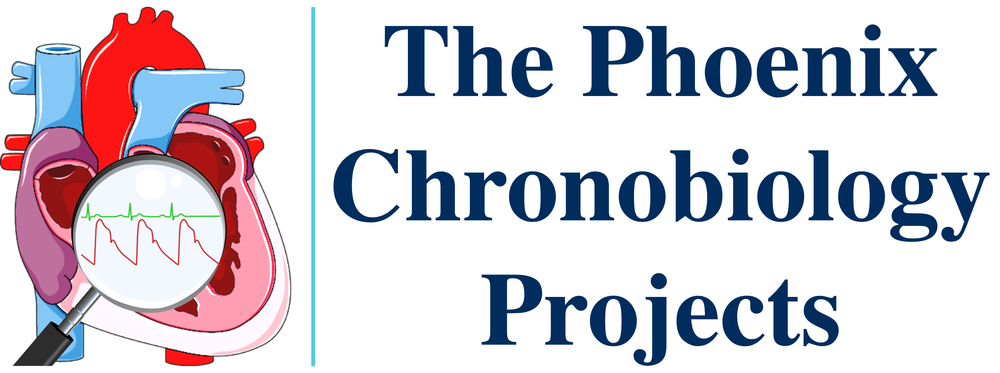

## Host

The Phoenix Projects operate as a study group of the [Twin Cities Section of the Institute of Electrical and Electronics Engineers](http://www.tc-ieee.org){: target="_blank" }.

The Phoenix Biorhythm site is hosted on GitHub Pages.

## Static Site Generator

**MkDocs** is a static site generator that's geared towards building project documentation. Documentation source files are written primarily in [Markdown](https://www.markdownguide.org){: target="_blank" }, and configured with a single YAML configuration file

This site uses Markdown, HTML and cascading style sheets.

For full documentation, visit [mkdocs.org](https://www.mkdocs.org){: target="_blank" }.

### MkDocs Commands

* `mkdocs new [dir-name]` - Create a new project.
* `mkdocs serve` - Start the live-reloading docs server.
* `mkdocs build` - Build the documentation site.
* `mkdocs -h` - Print help message and exit.

### Project layout

```
mkdocs.yml          # The configuration file.
docs/
    index.md        # The documentation homepage.
    about/
    architecture/
    glossary/
    images/
    javascripts/
    requirements/
    snippets/
    stylesheets/
    vision/
    ...             # Other markdown pages, images and other files.
```

### Theme

[Material for MkDocs](https://squidfunk.github.io/mkdocs-material){: target="_blank" }

### Macros

See [macros info](macros-info.md)

## Typography

Material for MkDocs directly integrates with [Google Fonts](https://fonts.google.com/){: target="_blank" }. All fonts are taken from that collection.

Body text and titles are set in {: alt="cabin" style="vertical-align: bottom; height: 32px;" }, a nonserif font. 

Code samples are set in {: alt="Ubuntu Mono" style="vertical-align: bottom; height: 32px;" }, a nonserif, monospace font.

For clients who do not have these fonts, the style sheets specify some standard alternatives.

See also "[Privacy](#privacy)".

## Palette

The site provides both light and dark color schemes:

| Mode | Color Scheme |
| ---- | ------------ |
| Light | MkDocs default |
| Dark | MkDocs slate |

The primary color is set to <span style="color:#546d78; font-weight: bold;">blue-grey (#546d78)</span>.

The accent color is set to <span style="color:#4051b5; font-weight: bold;">indigo (#4051b5)</span>.

## Graphics

| Image&nbsp;&nbsp;&nbsp;&nbsp;&nbsp;&nbsp;&nbsp;&nbsp; | Explanation | Source |
| ------ | ----------- | ------ |
|{: style="height:80px;"} | The **Phoenix Projects mark** symbolizes the investigation of variation in blood pressure. | The Phoenix is a composite of the following three images. |
| {: style="height:80px;"} | The interior of a human heart and some of the blood vessels | SERVIER MEDICAL ART, a service to medicine provided by Les Laboratoires Servier [www.servier.com](https://www.servier.com/){: target="_blank" }. Image retrieved from [https://smart.servier.com/wp-content/uploads/2016/10/coeur_01.png](https://smart.servier.com/wp-content/uploads/2016/10/coeur_01.png){: target="_blank" }.<br><br>Servier Medical Art is licensed under [CC BY 4.0 ](https://creativecommons.org/licenses/by/4.0/){: target="_blank" } |
| {: style="height:80px;"} | Magnifying glass | ["Magnifying Glass", by deelight](https://openclipart.org/detail/2202/magnifying-glass){: target="_blank" }, on [OPENCLIPART.org](https://openclipart.org){: target="_blank" }.<br><br>{: style="height: 20px;" } |
| {: style="height:60px;"} | An abstract: <ol><li>electrocardiogram (ECG) tracing in <span style="color:#33cc33; font-weight: bold;">lime green (#33cc33)</span></li><li>An abstract atrial blood pressure cycle in <span style="color:#cc3333; font-weight: bold;">persian red (#cc3333)</span></li></ol>The tracings are drawn along the same timescale. | Derived from the image titled "Timing of arterial pulse and the ECG", in ["Normal arterial line waveforms", **Deranged Physiology**: A free online resource for Intensive Care Medicine](https://www.derangedphysiology.com/main/sites/default/files/sites/default/files/CICM%20Primary/G%20Cardiovascular%20system/arterial%20line%20timing%20with%20ECG.JPG){: target="_blank" }, by [Alex Yartsev](https://derangedphysiology.com/main/contact){: target="_blank" }.<br><br>The derivation removed all but the waveforms and converted the result to SVG. |
| | The **Phoenix Logo** incorporates the [Phoenix Mark](#phoenix-mark). | {: style="width: 212px; height:80px;"}  |
| {: style="width: 66px; height:60px;"} | | The **favicon** is "circadian rhythms" by bsd studio from [Noun Project](https://thenounproject.com/browse/icons/term/circadian-rhythms/){: target="_blank" title="Circadian Rhythms"} (CC BY 3.0). |

The [hero image](../images/hero-heart.svg){: target="_blank" } on the site's home page is the Phoenix Projects mark with CCS animation added to the waveforms.

## Math Notation

Math statements are rendered with the [LaTex](https://en.wikibooks.org/wiki/LaTeX/Mathematics){: target="_blank" } typesetting language, using the [MathJax](https://squidfunk.github.io/mkdocs-material/reference/math/){: target="_blank" } library for displaying mathematical content in browsers. MathJax is incorporated into MkDocs using [arithmatex](https://facelessuser.github.io/pymdown-extensions/extensions/arithmatex/){: target="_blank" }, a Python Markdown extension.

## Privacy

The site uses the [privacy plugin built into Material for MkDocs](https://squidfunk.github.io/mkdocs-material/plugins/privacy/){: target="_blank" }. The plugin:

1. Scans the generated HTML for external assets, such as scripts, style sheets, images, and web fonts.
2. Downloads them.
3. Stores them in the site directory.
4. Replaces all references with links to the downloaded copies for self-hosting.

## License

<p xmlns:cc="http://creativecommons.org/ns#" ><a rel="cc:attributionURL" href="https://cadams4341.github.io/phoenix-biorhythm-platform/">This work</a> is licensed under <a href="http://creativecommons.org/licenses/by/4.0/?ref=chooser-v1" target="_blank" rel="license noopener noreferrer" style="display:inline-block;">Creative Commons Attribution 4.0 International Public License</a>.</p>
