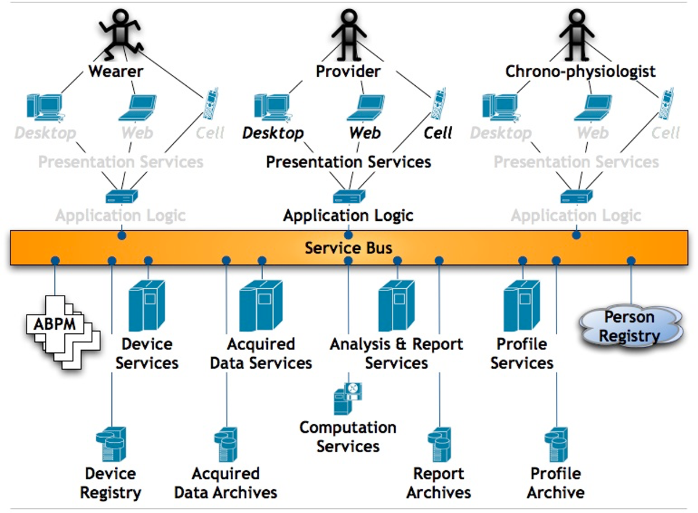
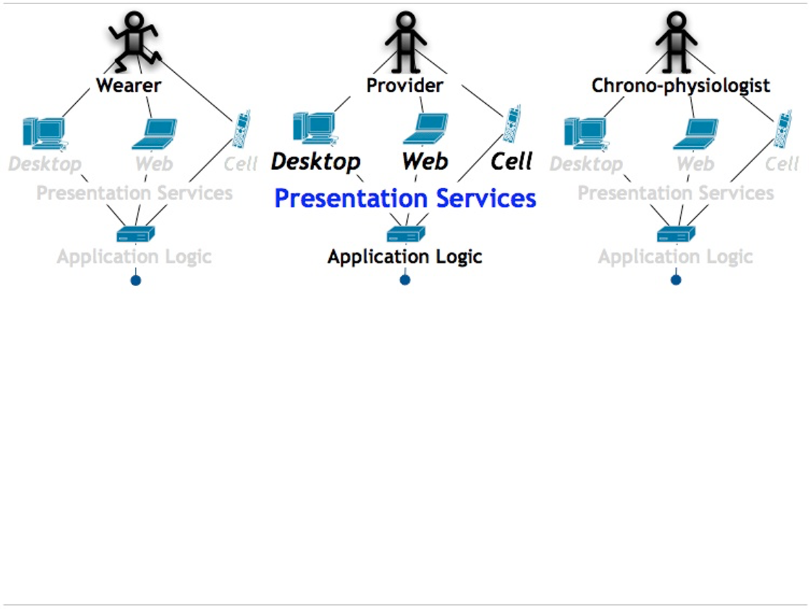
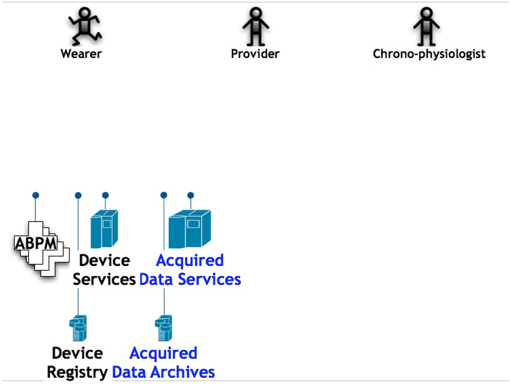
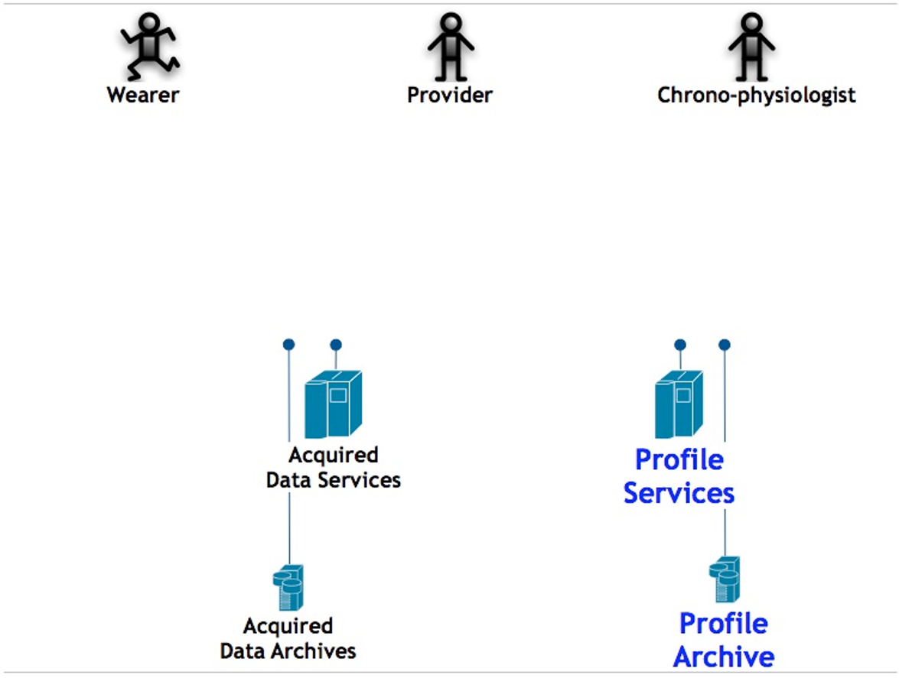
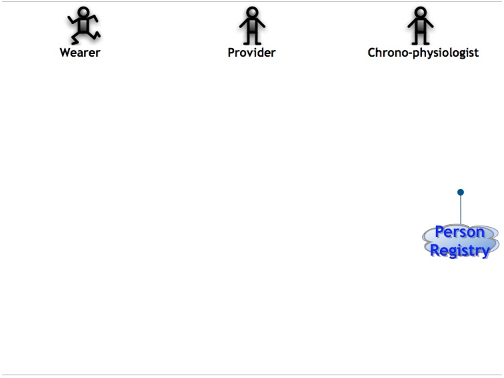
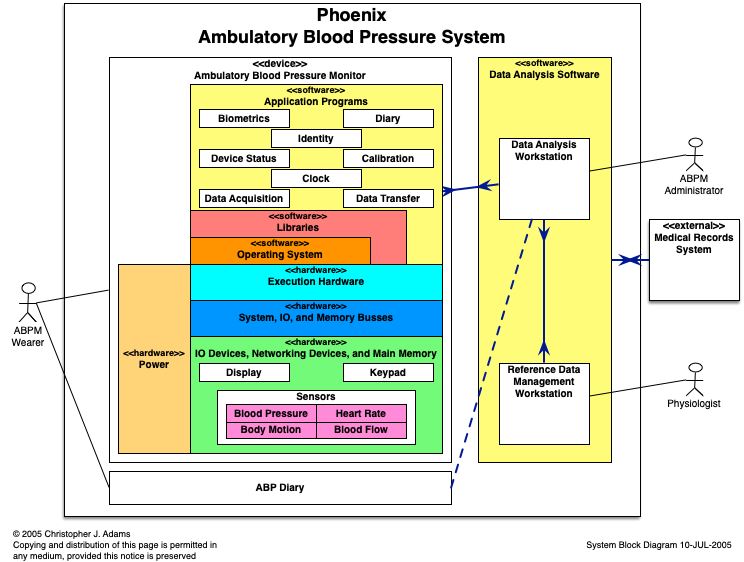

![Under Construction][def]

[def]: ../images/underconstruction.svg

!!! bug
    The diagrams in this article are out-of-date but included as placeholders to organize the article.

Inexpensive
: Open source
: Free intellectual property, volunteer labor

Highly decomposed
: Consequence of open source
: Each component quickly engineered by very small team (usually one person)

Extensible &mdash; highly recomposable
: Consequence of multiple actors, vaguely organized
: Evolving user classes, usage scenarios, environments
: Highly re-usable components

Scalable
: Ready to cope with volume increases due to:

    - Wearers
    - Acquired data
    - Analysis requests

Secure
: Manage person (patient) identity externally

Maintains privacy of data subject
: 1. Wearer owns measurements of the wearer's body
  1. Caregivers are custodians
  1. System operators are custodians
  1. Control belongs to the user

## Architecture Viewpoint
!!! bug
    Refactor for microservice architecture rather than a service bus architecture.

## Applications

## Presentation Services

## Data Acquisition

## Modeling and Profiling

## Person Identity Management

## Analysis &amp; Reporting

## System Block Diagram

