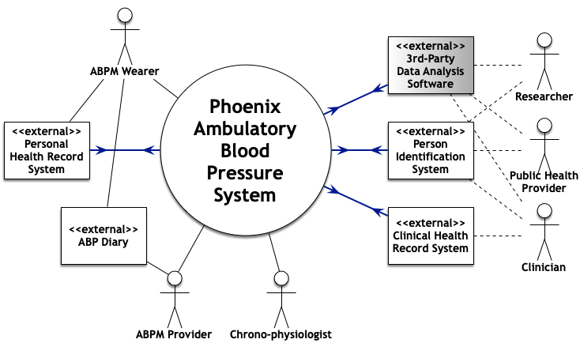
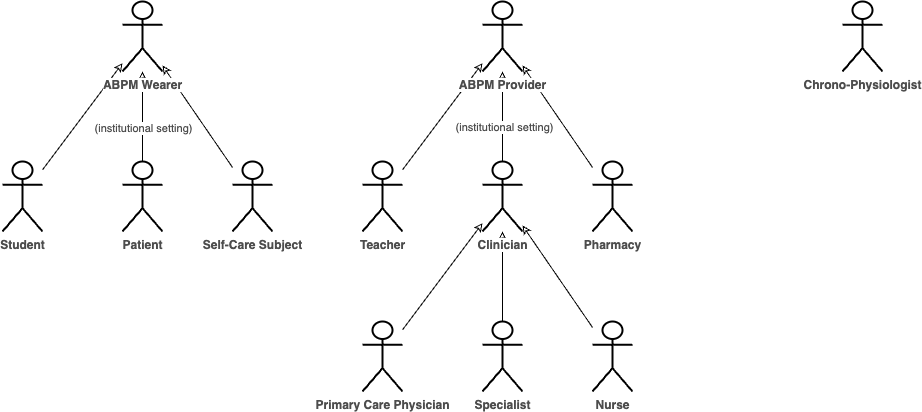

## Overview

The **Biorhythm Analytics Platform** employs a [canonical data model](https://en.wikipedia.org/wiki/Canonical_model){: target="_blank" } of ambulatory blood pressure monitors and their measurements, to decouple the system from specific monitors.

The system uses blood pressure measurements taken approximately every 30 minutes, day and night, in ambulatory fashion. Ideally, seven days of data are available.

The system can stitch batches of data into a continuous sequence, to provide a health history for an individual.

The imported and sequenced data is analyzed with **[cosinor](../../algorithms/cosinor.md)** and **[cumulative-sum](../../algorithms/cusum.md)** algorithms.

The results of an analysis is available directly to the patient, and when appropriate, to the patient’s healthcare provider. Analysis solutions are automated and easy to use.

The associated databases contain physiological data about large numbers of individuals over time, as well as physiological and psychological data on populations. The databases are available to chrono-physiologists who create the reference sets needed by the analysis techniques, as well as to chronobiology researchers.

The solution is global in scope. Its capability is widely distributed and fronted by multi-linguage websites.

The solution employs a zero-trust security model[^zero], with defense in depth[^did].

The solution treats privacy[^privacy] as paramount, giving the patient control over who has access to the patient's data.

The public-facing websites contain:

* The analysis tools
* Libraries of reference materials for different audiences (physician, general public, student)
* Lists of commercially-available ambulatory blood pressure monitors

## Context

!!! bug

    Need to label and describe the data flows show in blue below.

Inputs: blood pressure measurements taken approximately every 30 minutes, day and night, in ambulatory fashion.

## Actors

### Actor profile table

| Actor | Profile: Background and Skills |
| ----- | ------------------------------ |
| patient | May be sick or may want to know health status.  May vary between “Does not want to be bothered” and wanting biofeedback to modify behavior |
| self&#8209;care&nbsp;subject | Similar to a _patient_ but neither under the care of a _clinician_ nor in an institutional setting |
| specialist | A _physician_  Called for help by primary care physician |
| clinician | Deals directly with _patients_  May access medical records  May be primary care physician, secondary care physician (specialist), physician’s assistant, registered nurse, nursing assistant, certified medical assistant |
| physician | A _clinician_  Makes clinical decisions  Diagnoses patient |
| nurse | A _clinician_  Deals directly with device  Manages interaction between device and patient  Responsible for data transfer  Creates report for physician  Creates report for patient |

## Use cases

!!! bug

    Transform the following into a more formal set of [use cases](https://en.wikipedia.org/wiki/Use-case_analysis){: target="_blank" }.

The mechanism for detecting high risk of stroke and guiding treatment requires “continuous” blood pressure measurements; blood pressure measurements taken approximately every 30 minutes, day and night, in ambulatory fashion, are analyzed via cosinor and cumulative sum.

The analysis is automated on, and dispensed from, a worldwide multi-lingual website.  The results of the analysis is made available to the patient directly, and when appropriate, to the patient’s healthcare provider.  The associated databases are useful to chronobiology researchers, as they contain physiological data on large numbers of individuals over time as well as physiological and psychological data on populations.

The chronobiological analyses used in the first version of the website are Sphygmochron™ reports (circadian rhythm analysis based on cosinor mathematics) and CUSUM reports (based on cumulative sum mathematics derived from the manufacturing “quality control” arena).  The Sphygmochron detects six Vascular Variability Disorders (VVDs, persistent incorrect circadian rhythm characteristics in blood pressure or heart rate) that act as indicators of risk of stroke.  VVDs are mathematically defined as anomalies in the circadian phase, amplitude, and MESOR (a time-adjusted average) of BP and HR time series, when compared to healthy peers of the same gender and age group.  One VVD is a more precise definition of hypertension than that defined by the WHO, and others VVDs represent independent, additive indicators of stroke risk; an individual with MESOR hypertension, circadian hyper-amplitude tension, excessive pulse pressure, and deficient heart rate variability has a nearly 100% risk of stroke within six years.

The CUSUM detects the time at which changes in a metric such as SBP MESOR became statistically significant.  The Halberg Chronobiology Center developed a “self-starting CUSUM” that eliminates the need to specify a “target value” to be met.  

The website provides the reports and data access mechanisms that meet appropriate security and privacy constraints.  Standard search and relational-database query capability is provided.  The public-facing website contains the analysis tools, libraries of reference materials for different audiences (physician, general public, student), and lists of commercially-available cABPMs.

The website allows the general public to discover individualized treatments that are more effective than those that have passed one-size-fits-all style clinical trials, and will allow comparative analyses of individual and population based physiological and psychological data, starting with but not limited to their own blood pressure.

## Required attributes

!!! bug

    Reconcile the following with [Design goals](https://phoenix-chronobiology.github.io/library/2024/06/01/about-design-goals/) and [Quality goals](https://phoenix-chronobiology.github.io/library/2024/06/01/about-quality-goals/).

Inexpensive
: Free and open source software[^foss]

Highly decomposed
: Each component quickly engineered by very small team (usually one person)

Extensible &mdash; highly recomposable
: Multiple actors, vaguely organized
: Evolving user classes, usage scenarios, environments
: Highly re-usable components

Scalable
: Ready to cope with volume increases due to:

- Wearers
- Acquired data
- Analysis requests

Secure
: The design incorporates:

* Threat modeling[^threat]
* Principle of least privilege[^polp]
* Defense in depth &mdash; zero trust[^zero]
* Secure defaults
* Person identity management

Maintains privacy of data subject
: 1. Wearer owns measurements of the wearer's body
1. Caregivers are custodians
1. System operators are custodians
1. Control belongs to the user

## Exclusions

### Social networks

The solution previously envisioned connections to popular social networking websites[^social] as means to motivate members of the general public to use the system and disseminate information that they find to be trustworthy and popular.  The social networking mechanisms would be designed to allow the general public to collaborate and discover individualized treatments that are more effective than those that have passed one-size-fits-all style clinical trials, and would allow comparative analyses of individual and population based physiological and psychological data, starting with but not limited to their own blood pressure.

Links to social networks are problematic because they would open vulnerabilities to privacy and security.

[^did]: Wikipedia. "Defense in depth (computing)". Website, accessed 17 May 2024. [https://en.wikipedia.org/wiki/Defense_in_depth_(computing](https://en.wikipedia.org/wiki/Defense_in_depth_(computing)){: target="_blank" }.

[^foss]: Wikipedia. "Free and open-source software". Website, accessed 8 March 2024. [https://en.wikipedia.org/wiki/Free_and_open-source_software](https://en.wikipedia.org/wiki/Free_and_open-source_software){: target="_blank" }.

[^polp]: Wikipedia. "Priciple of Least Privelege". Website, accessed 8 March 2024. [https://en.wikipedia.org/wiki/Principle_of_least_privilege](https://en.wikipedia.org/wiki/Principle_of_least_privilege){: target="_blank" }.

[^privacy]: Wikipedia. "Privacy". Website, accessed 16 May 2024. [https://en.wikipedia.org/wiki/Privacy](https://en.wikipedia.org/wiki/Privacy){: target="_blank" }.

[^social]: Wikipedia. "Social networking service". Website, accessed 16 May 2024. [https://en.wikipedia.org/wiki/Social_networking_service](https://en.wikipedia.org/wiki/Social_networking_service){: target="_blank" }.

[^threat]: Wikipedia. "Threat model". Website, accessed 8 March 2024. [https://en.wikipedia.org/wiki/Threat_model](https://en.wikipedia.org/wiki/Threat_model){: target="_blank" }.

[^zero]: Wikipedia. "Zero Trust Security Model". Website, accessed 8 March 2024. [https://en.wikipedia.org/wiki/Zero_trust_security_model](https://en.wikipedia.org/wiki/Zero_trust_security_model){: target="_blank" }.
