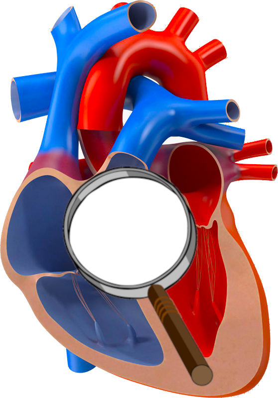

<div class="hero-block">
  <div class="hero-monitor">
      
      <svg class="ekg" version="1.1" xmlns="http://www.w3.org/2000/svg" xmlns:xlink="http://www.w3.org/1999/xlink"
          viewBox="0 0 500 200" xml:space="preserve">
        <g>
            <polyline class="ekg" points="366.6,113.8 328.2,113.8 310.3,132.3 296,70.7 246.8,127.4 241.6,120.2 233.9,166.4
                227,27.6 213.2,118.3 211.8,112.3 205.1,126.1 198.2,108.5 194.1,124.4 184.5,92.9 174.1,113 144.3,113"/>
        </g>
      </svg>
  </div>
  <p class="hero-tagline">
    A platform for chronobiometric analysis
  </p>
</div>
#
## Introduction

Lorem ipsum dolor sit amet, consectetur adipiscing elit. In aliquet lorem urna, non viverra justo luctus nec. Fusce nibh purus, auctor ut ex eget, cursus vehicula sem. Nunc pretium condimentum nisi, blandit feugiat tortor hendrerit eget. Vestibulum in ullamcorper magna. Ut posuere nibh congue purus ultrices finibus laoreet non lacus. Proin eu dignissim lorem. Donec sit amet feugiat neque. Aliquam at laoreet erat.

```
Hello, World
```
