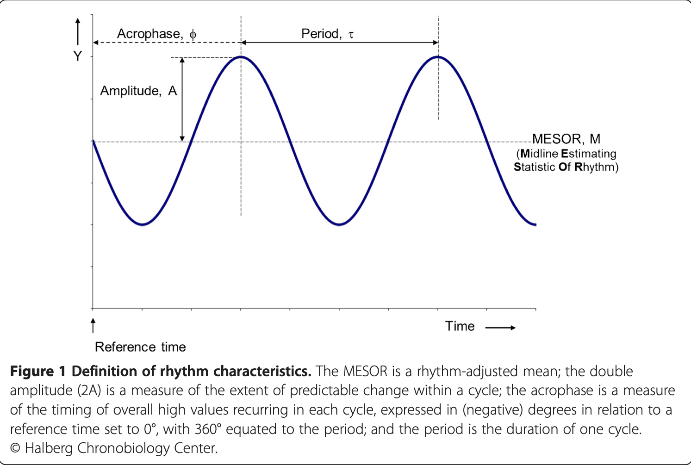

Jump to:
[A](#a) |
[B](#b) |
[C](#c) |
[D](#d) |
[E](#e) |
[F](#f) |
[G](#g) |
[H](#h) |
[I](#i) |
[J](#j) |
[K](#k) |
[L](#l) |
[M](#m) |
[N](#n) |
[O](#o) |
[P](#p) |
[Q](#q) |
[R](#r) |
[S](#s) |
[T](#t) |
[U](#u) |
[V](#v) |
[W](#w) |
[X](#x) |
[Y](#y) |
[Z](#z) |
[Other](#other)

### A

acrometron
: [statistics]
: The measure of the highest predicted value of a rhythm.
: Contrast with [bathymetron](#bathymetron).

acrophase
: [statistics]
:   1. Measure of timing of a rhythm in relation to a defined reference time point selected by the investigator (e. g., local midnight for circadian rhythms); used for data which can be described by the fitting of a mathematical model, e.g., a cosine curve, and represents the crest time of the cosine curve best fitting to the data; may be expressed in (negative) degrees as the lag from the acrophase reference (360&deg;C =1 period) or in calendar time units (e.g., hours and minutes for circadian rhythms, days or months for infradian rhythms). (source: [AAMCC](http://www.aamcc.net/glossary.htm){: target="_blank" })
    2. _n_. The time at which the peak of a rhythm occurs. Note: Originally, acrophase referred to the phase angle of the peak of a cosine wave fitted to the raw data of a rhythm (time series). When the term is applied to the actual rhythm, the acrophase will likely vary from cycle to cycle. Unit of measurement: hours (h) or degrees of circumference (&deg;) in relation to an absolute or arbitrary reference. Caveat: The official units of time and of plane angle in the International System of Units are, respectively, the second and the radian. // Cf. [cosinor](#cosinor) and [peak](#peak). (source: [circadian.org](http://www.circadian.org/dictionary.html){: target="_blank" })
    3. The lag between the reference time (midnight, or 0000 hours in a 24-hour day) and the time of the rhythm's crest.

activity of daily living (ADL)
: [medicine]
: the things a person normally does in daily living including any daily activity performed for self-care (such as feeding, bathing, dressing, grooming), work, homemaking, and leisure
: health professionals routinely refer to the ability or inability to perform ADLs as a measurement of the functional status of a person
: (source: [Wikipedia](http://en.wikipedia.org/wiki/Activity_of_daily_living){: target="_blank" })

ADL
: [medicine]
: See [activity of daily living](#activity-of-daily-living).

amplitude (A)
: [statistics]
:   1. Half the total predictable change in a rhythm.
    2. The measure of one half of the extent of the rhythmic change estimated by the mathematical model (e.g., cosine curve) best fitting to the data (e.g., the difference between the maximum and the rhythm-adjusted mean (MESOR) of the best fitting curve).
: (source: [AAMCC](http://www.aamcc.net/glossary.htm){: target="_blank" })

artery
: [physiology]
: A blood vessel that carries blood from the heart to the body.
: Contrast with [vein](#vein).

### B

bathymetron
: [statistics]
: The measure of the lowest predicted value of a rhythm.
: Contrast with [acrometron](#acrometron).

bathyphase
:   1. The time of the lowest point of a mathematical model (e. g., cosine curve) fitted to a time series and describing a rhythm. If a sine or a cosine curve is fitted, the bathyphase will differ 180' from the acrophase, measured in relation to a defined reference time point selected by the investigator (e.g., local midnight for circadian rhythms); may be expressed in degrees as the lag from the phase reference (360&deg; = I period) or in calendar time units (e. g., hours and minutes for circadian rhythms, days or months for infradian rhythm). (source: [AAMCC](http://www.aamcc.net/glossary.htm){: target="_blank" })
    2. _n_. The time at which the trough of a rhythm occurs. Note: This term is very rarely used. Unit of measurement: hours (h) or degrees of circumference (&deg;) in relation to an absolute or arbitrary reference. Caveat: The official units of time and of plane angle in the International System of Units are, respectively, the second and the radian. // Cf. [Acrophase](#acrophase). (source: [circadian.org](http://www.circadian.org/dictionary.html){: target="_blank" })

biology
: [definition needed]

biometric, biometrics
: [definition needed]

blood flow
: [definition needed]

blood pressure
: [physiology]
: the pressure exerted by the blood on the walls of the blood vessels
: Unless indicated otherwise, blood pressure refers to systemic arterial blood pressure, i.e., the pressure in the large arteries delivering blood to body parts other than the lungs, such as the brachial artery (in the arm). The pressure of the blood in other vessels is lower than the arterial pressure.

: Systemic arterial blood pressure is maintained by:

    * The contraction of the left ventricle,
    * The resistance of the arterioles and capillaries,
    * The elasticity of the arterial walls, as well as
    * The viscosity and volume of the blood.

: Blood pressure is expressed as relative to the ambient atmospheric pressure. Its values are universally stated in millimeters of mercury (mmHg).
: See also [systolic blood pressure](#systolic-blood-pressure) and [diastolic blood pressure](#diastolic-blood-pressure).

: (source: [Wikipedia](http://en.wikipedia.org){: target="_blank" })

blood pressure excess
: See [HBI](#hbi).

blood pressure mean
: [definition needed]

body motion
: [definition needed]

### C

capillary
: [physiology]
: One of the tiny blood vessels that connect the arterioles (the smallest divisions of the [arteries](#artery)) and the venules (the smallest divisions of the [veins](#vein)). The capillaries form a fine network in many parts of the body.

CAHRV
: See [chronome alterations of heart-rate variability](#chronome-alterations-of-heart-rate-variability).

cardiovascular
: [physiology]
: _adj_. Of or pertaining to or involving the heart and blood vessels.
: Contrast with [vascular](#vascular), a narrower concept that excludes the heart.
: The circulatory system is composed of the heart and blood vessels, and carries nutrients and oxygen to the tissues of the body and removes carbon dioxide and other wastes from them.
: Cardiovascular diseases affect the heart and blood vessels and include arteriosclerosis, coronary artery disease, heart valve disease, arrhythmia, heart failure, hypertension, orthostatic hypotension, shock, endocarditis, diseases of the aorta and its branches, disorders of the peripheral vascular system, and congenital heart disease.
: (source: [medterms.com](http://www.medterms.com){: target="_blank"})

cardiovascular variability
: [definition needed]
: See also [vascular variability](#vascular-variability).
: See also [heart rate variability](#heart-rate-variability).

CHAT
: Acronym for [circadian hyper-amplitude-tension](#circadian-hyper-amplitude-tension).
: Acronym for _Cetacean Hearing and Telemetry_

chronobiology
: [biology]
:   1. That aspect of biology concerned with the timing of biological events, especially repetitive or cyclic phenomena in individual organisms. (source: Stedmans)
    1. The study of biological systems as affected by time. Aging, biological rhythms, and cyclic phenomena are included. Statistical, computer-aided mathematical procedures are used to describe, in mathematical terminology, various biological functions over time. (source: Online Medical Dictionary)
    1. The scientific study of the effect of time on living systems. (source: Dorlands)
    1. A field of science that examines periodic (cyclic) phenomena in living organisms. (source: [Wikipedia](http://en.wikipedia.org/wiki/Chronobiology){: target="_blank" })
    1. The science of investigating and objectively quantifying phenomena and mechanisms of the biologic time structure, including the rhythmic manifestations of life. (source: [AAMC](http://www.aamcc.net/glossary.htm){: target="_blank" })
    1. _n_. The scientific study of biological rhythms. _adj_. = chronobiological. (source: [circadian.org](http://www.circadian.org/dictionary.html){: target="_blank" })

chronobiometry
: [definition needed]

chronodesm
: [in progress] A time-qualified reference range.

chronodesmic band
: [definition needed]

chronogram
: Display of data as a function of time. (source: [AAMC](http://www.aamcc.net/glossary.htm){: target="_blank" })

chronome
:   1. The quantitative description of some time-dependent feature.  The time-structure of some phenomenon, frequently biologic.
    2. _n_. The full complex of rhythms and temporal trends in an organism. The chronome consists of a multi-frequency spectrum of rhythms, trends, and residual structures, including intermodulations within and among physiological variables as well as changes with maturation and aging. // _adj_. = chronomic.
: (source: [circadian.org](http://www.circadian.org/dictionary.html){: target="_blank" })

chronome alterations of heart-rate variability (CAHRV)
: See [DHRV](#dhrv), [CHAT](#chat).

chronomedicine
: The application of [chronobiology](#chronobiology) to human health and disease.

chronomics
: The molecular mechanisms involved in[chronobiological](#chronobiology) phenomena.
: The quantitative aspects of [chronobiology](#chronobiology), particularly where comparison of cycles between organisms, or between an organism and external phenomena, is required.
: source: [Wikipedia](http://en.wikipedia.org/wiki/Chronomics)[: target="_blank" ]

chronotherapy
: the treatment of disease based on principles of [chronobiology](#chronobiology).
: _adj_. = chronotherapeutic.
: (source: [circadian.org](http://www.circadian.org/dictionary.html){: target="_blank" })

circadian
: _adj_.  Of or pertaining to about 24 hours.  Of or pertaining to rhythms with an about 24-hour ( &gt; 20 to &lt; 28 h) cycle length whether they are synchronized with a 24-hour periodic surrounding or not.
: Contrast with

    * circaseptan -- 7 (&plusmn;3) days
    * circadiseptan -- 14 (&plusmn;3) days
    * circavigintan --  20 (&plusmn;3) days
    * circatrigintan --  30 (&plusmn;5) days
    * circasemiannual -- half year
    * circannual -- 1 year (&plusmn;2 months)

: (source: [AAMCC](http://www.aamcc.net/glossary.htm){: target="_blank" })

circadian ecphasia
: [chronomedicine]
: an odd timing of the [circadian](#circadian) rhythm of [diastolic blood pressure](#diastolic-blood-pressure)
: the dissociation of the [circadian](#circadian) rhythms of [blood pressure](#blood-pressure) and of [heart rate](#heart-rate), such as when a person's blood pressure and heart rate peak at different times of the day
: Circadian ecphasia can be an indicator of Type-II diabetes.

circadian hyper-amplitude-tension (CHAT)
: [chronomedicine]
: The problem of excessive variability of blood pressure during a 24-hour interval.
: See also [hyperamplitude tension](#hyperamplitude-tension).

circannual
: _adj_.  Of or pertaining to biological processes occurring at about 1-year intervals.
: Compare with [circadian](#circadian), [circaseptan](#circaseptan), [infradian](#infradian), [ultradian](#ultradian).

circaseptan
: _adj_.  Of or pertaining to biological processes occurring at about 7-day intervals.
: Compare with [circadian](#circadian), [circannual](#circannual), [infradian](#infradian), [ultradian](#ultradian).

clinician
: a health professional engaged in the care of patients, as distinguished from one working in other areas
: an expert clinical physician and teacher

cNIBP
: Initialism of _Continuous Non-Invasive Blood Pressure_.

coefficient matrix
: [linear and multilinear algebra]; [matrix theory]
: See also [triangular matrix](#triangular-matrix), [orthogonal matrix](#orthogonal-matrix).

compliance
: [physiology]
:   1. the quality of yielding to pressure or force without disruption
    2. an expression of the ability to yield to pressure without disruption, such as the distensibility of an air- or fluid-filled organ, e.g., the lung or urinary bladder, measured in terms of unit of volume change per unit of pressure change
: Symbol C.
: The reciprocal of elastance.
: (source: Dorlands)

cosinor analysis
: [statistics] Least squares approximation of a time series using a cosine function of known period.
: The following equation is a single-component model of circadian rhythms and is typical of cosinor analysis.

    \(Y(t) = M + A\cdot\left(\frac{2\pi\mathnormal{t}}{\tau} + \phi\right) + e(t)\)

    Where:

    \(
        \begin{align}
        M &= \text{the MESOR (Midline Statistic Of Rhythm, a rhythm-adjusted mean)} \newline
        A &= \text{the amplitude (a measure of half the extent of predictable variation within a cycle)} \newline
        \phi &= \text{the acrophase (a measure of the time of overall high values recurring in each cycle)} \newline
        \tau &= \text{the period (duration of one cycle)} \newline
        e(t) &= \text{the error term}
        \end{align}
    \)

    {: style="width: 60%;" }

    **Definition of rhythm characteristics.** The [MESOR](#mesor) is a rhythm-adjusted mean; the double amplitude (2A) is a measure of the extent of predictable change within a cycle; the [acrophase](#acrophase) is a measure of the timing of overall high values recurring in each cycle, expressed in (negative) degrees in relation to a reference time set to 0°, with 360° equated to the period; and the [period](#period) is the duration of one cycle. &copy; Halberg Chronobiology Center.
    
    (Cornelissen G. Cosinor-based rhythmometry. Theor Biol Med Model. 2014 Apr 11;11:16. doi: 10.1186/1742-4682-11-16. PMID: 24725531; PMCID: PMC3991883.[https://www.ncbi.nlm.nih.gov/pmc/articles/PMC3991883/](https://www.ncbi.nlm.nih.gov/pmc/articles/PMC3991883/){: target="_blank" }.)

### D

decreased heart rate variability (DHRV)
: [medicine]
: decreased [standard deviation](#standard-deviation) of [heart rate](#heart-rate)
: [definition is preliminary -- need explanation of clinical relevance]

DHRV
: Initialism for [decreased heart rate variability](#decreased heart rate variability).

: [medicine]
:   1. The nature of a disease; the identification of an illness.
    1. A conclusion or decision reached by diagnosis

: (source: [medterms.com](http://www.medterms.com){: target="_blank" })

diagonal matrix
: [linear and multilinear algebra; matrix theory]
: a square matrix in which all off-diagonal entries are zero

diastole
: [physiology]
: The period of time when the heart relaxes after contraction.
: Contrast with [systole](#systole).

diastolic
: [physiology]
: _adj_. Of or pertaining to diastole.
: [blood pressure] Of or pertaining to the lowest, nadir, pressure within the blood stream occurring in between heart beats.
: Contrast with [systolic](#systolic).

diastolic blood pressure
: [physiology]
: The lowest blood pressure in the arteries during the cardiac cycle, during the resting phase of the heart
: Contrast with [systolic blood pressure](#systolic-blood-pressure).

disease
: [medicine]
: illness or sickness often characterized by typical patient problems (symptoms) and physical findings (signs)
: (source: [medterms.com](http://www.medterms.com){: target="_blank" })

disorder
: [medicine]
: a condition in which there is a disturbance of normal functioning
: In many cases, the terms <dfn>disease</dfn>, <dfn>disorder</dfn>, <dfn>morbidity</dfn> and <dfn>illness</dfn> are used interchangeably. In some situations, specific terms are considered preferable.
: See also [http://en.wikipedia.org/wiki/Disorder_(medicine)](http://en.wikipedia.org/wiki/Disorder_%28medicine%29){: target="_blank" }

double amplitude
: [statistics]
: [definition needed]

double product
: [statistics]
: [definition needed]

### E

ecphasia
: [definition needed]

elastance
: [physiology]
:   1. the quality of recoiling without disruption upon removal of pressure
    2. an expression of the ability to recoil without disruption when pressure is removed, such as that of an air- or fluid-filled organ, e.g., the lung or urinary bladder, measured in terms of unit of pressure change per unit of volume change
: Symbol E.
: The reciprocal of [compliance](#compliance).

elevated pulse pressure
: [medicine]
: The problem of too large a difference between [diastolic](#diastolic-blood-pressure) and [systolic blood pressure](#systolic-blood-pressure) (between when the heart contracts and relaxes, respectively).
: [definition is preliminary -- need explanation of clinical relevance]

### H

HBI
: See [hyperbaric index](#hyperbaric-index).

heart attack
: [medicine]
: The death of heart muscle due to the loss of blood supply.
: The loss of blood supply is usually caused by a complete blockage of a coronary artery, one of the arteries that supplies blood to the heart muscle. Death of the heart muscle, in turn, causes chest pain and electrical instability of the heart muscle tissue.
: (source: [medterms.com](http://www.medterms.com){: target="_blank" })

heart rate
: [physiology]
: the frequency of the cardiac cycle
: Heart rate is considered one of the four vital signs, along with temperature, [blood pressure](#blood-pressure), and respiratory rate. Heart rate is usually calculated as the number of contractions (beats) of the heart in one minute and expressed as "beats per minute" (bpm).

: (source: [Wikipedia](http://en.wikipedia.org/wiki/Heart_rate){: target="_blank" })

heart rate variability (HRV)
: [physiology]
: [_preliminary_]
: The oscillation either in the interval between consecutive heartbeats or between consecutive instantaneous heart rates.
: See also [cardiovascular variability](#cariovascular-variability).
: See also [vascular variability](#vascular-variability).
: Measurement:  multiple techniques exist.  Over short spans, say 5 to 15 minutes, a beat-to-beat interval (e.g., the R-R interval) is measured in milliseconds, usually from an electrocardiogram.  Over longer spans, the instantaneous heart rate, measured in beats per minute, are easier to collect.  Considering a 24-hour or longer span includes the variability associated with circadian variation.
: Sometimes referred to as jitter.
: A low level of change in the heart rate (or inter-beat interval) can indicate a lack of flexibility to respond to external demands, such as to exercise.
: The oscillation either in the interval between consecutive heartbeats or between consecutive instantaneous heart rates.
: (source: [Wikipedia](http://en.wikipedia.org/wiki/Heart_rate_variability){: target="_blank" }, and [http://circ.ahajournals.org/cgi/content/full/93/5/1043](http://circ.ahajournals.org/cgi/content/full/93/5/1043){: target="_blank" })

HRV
: [physiology]
: See [heart-rate variability](#heart-rate-variability).

hyperamplitude tension
: [medicine]
: The problem of abnormally variable blood pressure.
: See also [circadian hyper-amplitude tension (CHAT)](#circadian-hyper-amplitude-tension).

hyperbaric
: [physicis]
: _adj_.  Of or pertaining to pressure of ambient gases greater than 1 atmosphere.

hyperbaric index (HBI)
: [definition needed]

hypertension
: [medicine]
: The problem of abnormally high blood pressure.
: Contrast with [hypotension](#hypotension).
: There are three main types of hypertension, namely:

    * arterial hypertension - with an elevated blood pressure in the systemic circulation

        Pregnancy-induced hypertension is newly diagnosed arterial hypertension in pregnant women. It requires close monitoring.

    * pulmonary hypertension - with an elevated blood pressure in the pulmonary circulation
    * portal hypertension - with an elevated blood pressure in the portocaval system

hypertensive retinopathy
: [Retinal disease](#retinopathy) due to high blood pressure.

hypotension
: [medicine]
: The problem of abnormally low blood pressure.
: Contrast with [hypertension](#hypertension).

### I

illness
: [medicine]
: Impairment of normal physiological function affecting part or all of an organism.
: <dfn>disease</dfn>

infradian
: [chronobiology]
: _adj_. Of or pertaining to biologic variations or rhythms occurring in cycles less frequent than every 24 hours, e.g., 19 to 22 days.

### J

jitter
: [electronics and signal processing]  Small rapid variations in a waveform resulting from fluctuations in the voltage supply or mechanical vibrations or other sources.
: [imaging]  Low amplitude irregularities in echo location on an ultrasound display, attributed to electronic noise, mechanical disturbances, and other variables.
: [neurophysiology]  Muscle jitter.  The normal electric variability -- chaos -- measured by single-fiber EMG, in the interval between two action potentials of successive discharges of the same single muscle fiber in the same motor unit.
: [cardiology]  See [heart rate variability](#heart-rate-variability).

### K

Korotkoff sounds
: [medicine]
: The sounds that medical personnel listen for when they are taking blood pressure using a non-invasive procedure.

### L

least squares
: [linear and multilinear algebra]; [matrix theory]
: A mathematical optimization technique which, when given a series of measured data, attempts to find a function which closely approximates the data (a "best fit").  It attempts to minimize the sum of the squares of the ordinate differences (called residuals) between points generated by the function and corresponding points in the data.
: (source: [Wikipedia](http://en.wikipedia.org/wiki/Least_squares){: target="_blank" })

least squares approximation
: [statistics]
: See [least squares](#least-squares).

least squares estimation
: [statistics]
: See [least squares](#least-squares).

linear algebra
: [[mathematics](#mathematics)]

### M

macrophase
: [statistics]
: the lag between the reference time (midnight, or 0000 hours in a 24-hour day) and the time of the highest value among the individual data points or averages of data points

mathematics
: [domains]  a science (or group of related sciences) dealing with the logic of quantity and shape and arrangement

matrix theory
: [[mathematics](#mathematics)]

mean arterial pressure
: [physiology]

medical device
: any physical item used in medical treatment
: Examples: cardiac pacemaker, thermometer, wheelchair

medicine
: [domains]  the art and science of the diagnosis and treatment of disease and the maintenance of health.

MESOR (midline estimating statistic of rhythm)
: [statistics]
: 1. The value midway between the highest and the lowest values of the (cosine) function that best fits the data.

        The "M" is equal to the arithmetic mean only for equidistant data covering an integral number of cycles.  If, for example, most of the data are clustered around the peak of the curve, because the researcher gathered more data at this time, the arithmetic mean will be much higher than the MESOR.
        (source: [AAMCC](http://www.aamcc.net/glossary.htm){: target="_blank" })

    2. _n_. An estimate of central tendency of the distribution of values of an oscillating variable (the average value around which the variable oscillates).

        The MESOR is a circadian rhythm-adjusted mean based on the parameters of a cosine function fitted to the raw data. Note: When a process is known to be rhythmic, and the data points are not equidistant or the sample size is small, the MESOR often provides a more appropriate unbiased estimator of central tendency than does the arithmetic mean of the raw data. // Cf. Mean level.
        (source: [circadian.org](http://www.circadian.org/dictionary.html){: target="_blank" })

MESOR-hypertension
: [hypertension](#hypertension) as indicated by measurements taken throughout multiple days
: [definition is preliminary -- need explanation of clinical relevance]
: Though the condition is sometimes categorized as a vascular variability disorder, the MESOR is a type of average and not a measure of variability per se.
One way to look at this is to say that on the basis of the data, the circadian variation is assessed by fitting a model to the data, and this model is characterized by three parameters:  the MESOR, the 24-hour amplitude, the 24-hour acrophase.
(If considered, a two-component model is charactered by five parameters, the three components of the one-component model plus the 12-hour amplitude and the 12-hour acrophase).

morbidity
: [medicine]
: a diseased condition or state
: the incidence or prevalence of a disease or of all diseases
: (source: Dorlands)

multilinear algebra
: [[mathematics](#mathematics)]

### N

nurse clinician

: a registered nurse who has received special training and can perform many of the duties of a physician

### O

orthogonal matrix
: [linear and multilinear algebra]; [matrix theory]
: See also [coefficient matrix](#coefficient-matrix), [triangular matrix](#triangular-matrix).

### P

parametric
: _adj_.
:   1. Dependent on the parameters (particularly intensity and duration) of the [Zeitgeber](#zeitgeber). Note: In strict terms, all biological responses are parametric. However, the expression non-parametric entrainment is often used to denote entrainment that is primarily due to the timing (rather than the intensity or duration) of the synchronizing stimulus. Antonym: = non-parametric.
    2. Dependent on the parameters (usually the mean and variance) of a distribution. Note: In inferential statistics, the most common parametric tests are the t-test and the analysis of variance (ANOVA). Antonym: = non-parametric.
: (source: [circadian.org](http://www.circadian.org/dictionary.html){: target="_blank" })

peak
: _n_. The point of culmination of an oscillatory function. Synonym: crest.
: (source: [circadian.org](http://www.circadian.org/dictionary.html){: target="_blank" })

percentage time elevation (PTE)
: [definition needed]

period
: The duration of one complete rhythmic cycle, measured from peak to peak, or form one reference time to the next, as from midnight to midnight in a 24-hour period.

physical therapy
: [domains] A branch of rehabilitative health that uses specially designed exercises and equipment to help patients regain or improve their physical abilities.

physiological monitoring
: [definition needed]

physiology
: [domains]
:   1. The properties and functions of animal and vegetable organs and tissues.
    2. The branch of the biological sciences dealing with the functioning of organisms.					

prehabilitation
: [physical therapy]
: strength and conditioning exercises for specific muscles that help to reduce injury risks, before an injury actually occurs
: the focus on physical therapy services that prevent the need for extended rehabilitation services by approaching the preventative aspects of injury or illness
: pre-surgical physical therapy aimed at reducing the negative impacts of, or speeding recovery from, surgery
: Contrast with [rehabilitation](#rehabilitation).

primary care
: [medicine]
: the medical care received on first contact with the medical system, before being referred elsewhere

primary care provider
: a physician chosen by or assigned to a patient, who both provides [primary care](#primary-care) and acts as a gatekeeper to control access to other medical services

pulse pressure
: [physiology]
: the difference between [diastolic](#diastolic-blood-pressure) and [systolic blood pressure](#systolic-blood-pressure) (between when the heart contracts and relaxes, respectively).

pulse transit time
: [physiology]
: The time that the pulse wave needs for the propagation from the aorta to the peripheral vessels.
: Pulse transit time is closely connected to blood pressure and the condition of the arterial vessels.

### R

rehabilitation
: restoration, following disease, illness, or injury, of the ability to function in a normal or near-normal manner
: the return of function after illness or injury, often with the assistance of specialized medical professionals
: the process of restoration of skills by a person who has had an illness or injury so as to regain maximum self-sufficiency and function in a normal or as near normal manner as possible
: the restoration of normal form and function after injury or illness
: the restoration of the ill or injured patient to optimal functional level in the home and community in relation to physical, psychosocial, vocational, and recreational activity
: the process of restoring a part of the body or a person to near-normal functioning after an injury or disease
: Contrast with [prehabilitation](#prehabilitation).

residual
: [statistics]
: the difference between results obtained through theoretical calculation and those obtained through observation

retinopathy
: [medicine]
: Any disease of the retina, the light-sensitive membrane at the back of the eye.
: The type of retinopathy is often specified.

    <dfn>Arteriosclerotic retinopathy</dfn> is retinal disease due to arteriosclerosis ("hardening of the arteries").

    <dfn>Diabetic retinopathy</dfn> is retinal disease associated with diabetes.

    See also [hypertensive retinopathy](#hypertensive-retinopathy) is retinal disease due to high blood pressure.

: (source: [medterms.com](http://www.medterms.com){: target="_blank" })

rhythm
: [definition needed]

### S

self-care
: [definition needed]

self-help
: [definition needed]

specialist, medical specialist
: [definition needed]

spectral analysis
: _n_. A mathematical procedure that evaluates the contribution of putative periodic components of a time series to the actual temporal profile of the series. // Cf. Fourier analysis.
: (source: [circadian.org](http://www.circadian.org/dictionary.html){: target="_blank" })

sphygmochron
: [chronomedicine]
: A report that is formatted for the interpretation of a patient's blood pressure and heart rate measurements over a defined period, such as 1 day, 2 days, or 7 days, by comparison with the blood pressure and heart rate profile of the patient's peer group.
: a 24-hour blood pressure record based on a computer comparison of a given subject's data with time-specified reference limits of clinically healthy peers of the same gender and age.   Sphygmochrons provide, by complementary (parametric and nonparametric) approaches, an inferential statistical basis for the diagnosis of blood pressure disorders
: a special form that summarizes a computer comparison of individual blood pressure profiles over time, with reference limits derived from databases obtained from clinically healthy peers

sphygmomanometer
: An inflatable cuff used to measure blood pressure.
: Operation:  The cuff is placed around the upper arm, at roughly the same vertical height as the heart while the subject is in a sitting position.  The cuff is inflated until the artery is completely occluded.  Listening with a stethoscope to the brachial artery at the elbow, the examiner slowly releases the pressure in the cuff.  As the pressure in the cuffs falls, a "whooshing" or pounding sound is heard (see Korotkoff sounds) when blood-flow first starts again in the artery. The pressure at which this sound began is noted and recorded as the systolic blood pressure. The cuff pressure is further released until the sound can _n_. longer be heard and this is recorded as the diastolic blood pressure.

square matrix
: [linear and multilinear algebra]; [matrix theory]
: a matrix having the same number of rows as columns; a matrix of size _n_.X n

standard deviation
: [statistics]
: the square root of the [variance](#variance) of some statistical population, data set, or probability distribution
: The standard deviation may be thought of as the average difference of the scores from the mean of distribution, how far they are away from the mean. A low standard deviation indicates that the data points tend to be very close to the mean, whereas high standard deviation indicates that the data are spread out over a large range of values.

: See [Wikipedia article](http://en.wikipedia.org/wiki/Standard_Deviation){: target="_blank" }

statistics
: [mathematics]
: a branch of applied mathematics concerned with the collection and interpretation of quantitative data and the use of probability theory to estimate population parameters

stroke
: [medicine]
: The sudden death of some brain cells due to a lack of oxygen when the blood flow to the brain is impaired by blockage or rupture of an artery to the brain.
: A stroke is also called a <dfn>cerebrovascular accident</dfn> or, for short, a <dfn>CVA</dfn>.
: (source: [medterms.com](http://www.medterms.com){: target="_blank" })

systole
: [physiology]
: The contraction of the chambers of the heart, which drives blood out of the chambers.
: Contrast with [diastole](#diastole).

systolic
: [physiology]
: _adj_. Of or pertaining to systole.
: [blood pressure]  Of or pertaining to the highest, peak, pressure within the blood stream occurring during each heart beat.
: Contrast with [diastolic](#diastolic).

systolic blood pressure
: [physiology
: the peak blood pressure in the arteries during the cardiac cycle, during the contraction phase of the heart
: Contrast with [diastolic blood pressure](#diastolic-blood-pressure).

### T

technician, medical office technician
: [definition needed]

triangular matrix
: [linear and multilinear algebra]; [matrix theory]
: See also [coefficient matrix](#coefficient-0matrix), [orthogonal matrix](#orthogonal-matrix).

### U

ultradian
: [chronobiology]
: _adj_. Of or pertaining to biologic variations or rhythms occurring in cycles more frequent than every 24 hours.
: Contrast with [circannual](#circannual), [circadian](#circadian), [circaseptan](#circaseptan), [infradian](#infradian).

### V

variability
: [statistics]
:   1. The state of being variable.

        (source: Dorlands)

    2. In statistics, statistical dispersion (also called statistical variability or variation) is variability or spread in a variable or a probability distribution.

        Common examples of measures of statistical dispersion are the variance, standard deviation and interquartile range.

        Dispersion is contrasted with location or central tendency, and together they are the most used properties of distributions.

        (source: See [Wikipedia](http://en.wikipedia.org/wiki/Statistical_variability){: target="_blank" })

variance
: [statistics]
: A measure of the variation shown by a set of observations; the average of the squared deviations from the mean; it is the square of the standard deviation.
: Of a random variable or distribution, the expected, or mean, value of the square of the deviation of that variable from its expected value or mean.
: The variance is a measure of the amount of variation within the values of that variable, taking account of all possible values and their probabilities or weightings (not just the extremes which give the range).
: (source: [Wikipedia](http://en.wikipedia.org/wiki/variance){: target="_blank" })

variation
: The act or state of varying; a partial change in the form, position, state, or qualities of a thing.
: [statistics] See [variance](#variance).

vascular
: [physiology]
: _adj_. Of or relating to the blood vessels of the body.
: The blood vessels of the body, as a group, are referred to as the vascular system.

: The blood vessels are composed of arteries, veins and capillaries &mdash; [arteries](#artery) that pass oxygen-rich blood to the tissues of the body; [veins](#vein) which return oxygen-depleted blood from the tissues to the lungs for oxygen; and the [capillaries](#capillary) that are the tiniest vessels and are between the arteries and veins.

: (source: [medterms.com](http://www.medterms.com){: target="_blank" })

vascular variability
: [physiology]
: [definition needed]
: See also [cardiovascular variability](#cardiovascular-variability).
: See also [heart rate variability](#heart-rate-variability).

vein
: [physiology]
: A blood vessel that carries blood from the capillaries toward the heart; all veins except the pulmonary carry unaerated blood.
: Contrast with [artery](#artery).

### W

wearable
: _adj_. Suitable for wear or able to be worn on the body

### Z

Zeitgeber
: An environmental agent or event that provides the cue for setting or resetting a biological clock.
: To be synchronized with our environment, we need the input of Zeitgebers. The most important Zeitgeber in nature is light. Social factors, chemical factors and activity can also serve as Zeitgebers. Light is a so-called photic type Zeitgeber, whereas activity, for example, is called a non-photic Zeitgeber for the biological clock.
: Zeitgeber comes from the German <dfn>Zeit</dfn>, time + <dfn>Geber</dfn>, giver = time-giver. The term <dfn>Zeitgeber</dfn> was introduced into science about 1954 by Jurgen Aschoff, then the Director of the Max-Planck-Institute in Erling-Andechs, near Munich.
: (source: [medterms.com](http://www.medterms.com){: target="_blank" })

